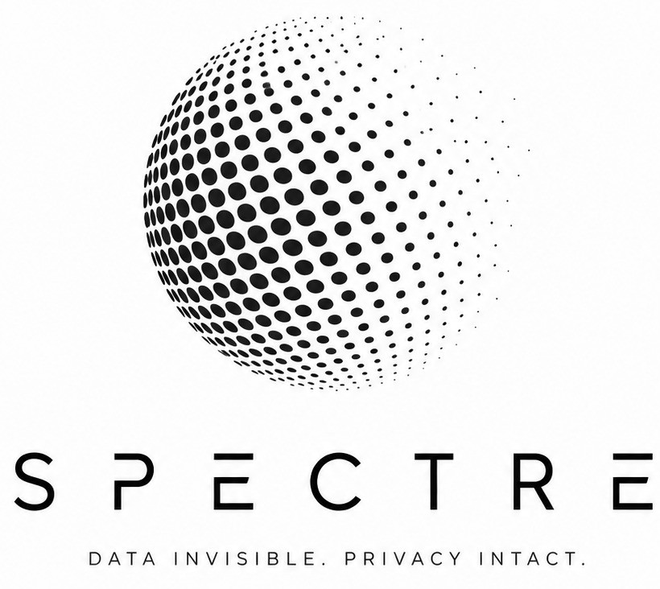

<div align="center">
  <p>
    
  </p>
</div>

# Spectre

Spectre is a privacy-first visual safety middleware built to protect sensitive identity data before it reaches an operational system, public stream, or shared screen. It detects risky visual information such as identity documents, faces, license plates, bank cards, receipts, and sensitive text, then redacts the risky areas while keeping the workflow usable for users and operators.

This project was developed for Garuda Hacks 7.0.

## Overview

Many digital services need users to upload documents or share visual information, but raw images often contain more private data than the destination system actually needs. Spectre sits between the unsafe source and the final destination.

Instead of passing raw documents or live frames directly forward, Spectre processes them locally, creates a safer redacted output, stores only the safe operational result for normal use, and keeps the original file locked in an encrypted vault for exceptional authorized access.

The application includes two main experiences:

- **User Workspace**: upload documents, preview redacted results, and use a live privacy filter.
- **Operator Console**: monitor processed records, vault metadata, access requests, runtime policy, audit logs, and system metrics.

## Purpose

Spectre is designed to reduce privacy risk in workflows that handle visual identity data. Its main goals are:

- Protect personal information before it is exposed to operational systems.
- Let organizations use the data they need without freely exposing raw originals.
- Provide a clear separation between redacted operational output and encrypted original files.
- Support accountable access to originals through request, approval, one-time token, and audit trail.
- Demonstrate local AI-based document and privacy detection without depending on an external recognition service.

## What Spectre Can Be Used For

Spectre is useful for scenarios where images, documents, camera feeds, or screen content may contain private information:

- **KYC and onboarding**: redact KTP, KK, SIM, passport, ATM card, receipt, face, and sensitive text before the document enters an operational workflow.
- **Government or institutional review**: keep redacted evidence available while preserving originals in a protected vault.
- **Live camera privacy**: blur sensitive objects in a webcam feed before it is shown publicly.
- **Screen sharing protection**: detect and redact sensitive identifiers such as NIK, phone numbers, bank account numbers, and salary-like values.
- **Audit-friendly data handling**: record important security events so operators can review what happened later.

## Program Architecture

Spectre is organized into three main parts:

### 1. Frontend

The frontend is a React and Vite application. It provides the user-facing workspace and the internal operator console.

The user side focuses on document upload, redacted previews, privacy explanation, and live filtering. The operator side focuses on processed records, vault visibility, government access simulation, key management, dynamic policy, audit logs, and metrics.

### 2. Backend

The backend is a FastAPI application. It receives uploaded documents or live frames, runs the detection and redaction pipeline, manages storage, and exposes the data needed by the frontend.

The backend also initializes the local database, loads the detection model at startup, prepares storage folders, and creates an active vault key when needed.

### 3. AI, Redaction, and Storage Layer

The AI layer uses a YOLO-based model to detect privacy-sensitive classes. The detected areas can be redacted using black boxes, blur, or pixelation depending on the selected policy.

Spectre separates stored data into two zones:

- **Operational Zone**: stores redacted images and non-private metadata for normal use.
- **Sovereign Vault**: stores encrypted original files using AES-256-GCM with RSA-wrapped keys.

This separation is the core idea of the project: the system can keep working with safe outputs while treating raw originals as protected material.

### 4. Training Workspace

The `Training` folder contains dataset generation, augmentation, training, and inference materials for the detection model. It includes scripts for synthetic data generation and notebooks for training and testing the YOLO model.

## AI Usage

AI was used during development to support code generation for synthetic data creation, model training workflows, and debugging.

## Application Flow

The main document flow works like this:

1. A user uploads an image or a single-page PDF.
2. The backend reads the file and prepares it for detection.
3. The detection model finds sensitive objects or regions.
4. Guardrail and policy logic decide which detections should be redacted.
5. Spectre creates a redacted output image.
6. The redacted result is stored in the Operational Zone.
7. The original file is encrypted and stored in the Sovereign Vault.
8. Metadata and audit events are recorded.
9. The frontend shows the safe output and processing summary.

For live camera and screen-share flows, Spectre processes data ephemerally. Frames or screen content are redacted and returned without being stored in the Operational Zone or Sovereign Vault.

## Project Structure

```text
Spectre/
|-- backend/        # FastAPI backend, AI pipeline, storage, vault, audit logic
|-- frontend/       # React + Vite frontend for user and operator workspaces
|-- Training/       # Dataset generation, augmentation, training, and inference files
|-- README.md
`-- LICENSE
```

## Running the Program

Run the backend first, then start the frontend.

### Backend

From the project root:

```powershell
cd backend
python -m venv .venv
.\.venv\Scripts\Activate.ps1
pip install -r requirements.txt
Copy-Item .env.example .env
uvicorn app.main:app --reload --host 127.0.0.1 --port 8000
```

The backend will be available at:

```text
http://127.0.0.1:8000
```

The API health check is available at:

```text
http://127.0.0.1:8000/api/health
```

Make sure the detection model exists in `backend/models`. By default, the environment file points to:

```text
backend/models/model_deteksi_yolo26n.pt
```

### Frontend

Open a second terminal from the project root:

```powershell
cd frontend
npm install
npm run dev
```

The frontend will be available at:

```text
http://127.0.0.1:5173
```

Vite is configured to proxy frontend `/api` requests to the backend at `http://127.0.0.1:8000`.

## Demo Access

On the sign-in screen, you can use the built-in demo shortcuts:

- **User demo** opens the user workspace.
- **Operator demo** opens the operator console.

The default demo tokens for government access, approval, and crypto administration are listed in `backend/.env.example`. For real deployment, those values should be replaced with secure secrets.

## Notes

Spectre is a prototype and demonstration system. It shows how privacy-sensitive visual data can be detected, redacted, separated, encrypted, and audited. Before using it in a production environment, the model, security configuration, authentication, storage policy, and deployment setup should be reviewed carefully.
